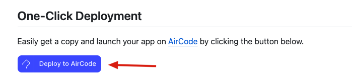

D2C image upload example, nodejs implementation. [English Version](./README-en.md)

#Example list

- ✅ Cloud functions, you only need to care about the core image upload logic, there is no need to bind a domain name, each function is an interface
   - [Getting Started] [upload.js](./examples/aircode/upload.js): Use AirCode file storage (free file storage limit 2GB)
   - [👍🏻Recommended] [uploadCOS.js](./examples/aircode/uploadCOS.js): Use Tencent Object Storage SDK and need to bind COS AccessID and AccessKey

AirCode supports one-click copying of projects and one-click copying of examples (login required)

- ✅ nodejs custom Web Server: complete control, domain name needs to be bound
   - [Advanced use] [index.js](./examples/nodejs/src/index.js): Use koa + Tencent Object Storage SDK to customize the image upload interface, which needs to be bound to COS AccessID and AccessKey.
- ❤️ If you have more implementation methods, please submit a PR

# Notice

- The image upload interface in the D2C plug-in needs to use the `https` protocol, because the page where the Figma plug-in environment is located uses the `https` protocol. Due to the browser's security policy, using the `http` protocol will cause the error below. If you encounter this problem, you can choose to use the `https` protocol or use the `https` interface provided by Cloud Function for free.

- The free storage limit of AirCode cloud function is 2GB, and the number of free calls is 100k times per month. Please check the free quota and paid plans page.

# Related Links

- D2C: https://semi.design/code/en-US/start/quick-start
- AirCode: https://docs.aircode.io
- koajs: https://koajs.com/
- Tencent Object Storage SDK: https://cloud.tencent.com/document/product/436/8629
- what-is-mixed-content: https://web.dev/articles/what-is-mixed-content