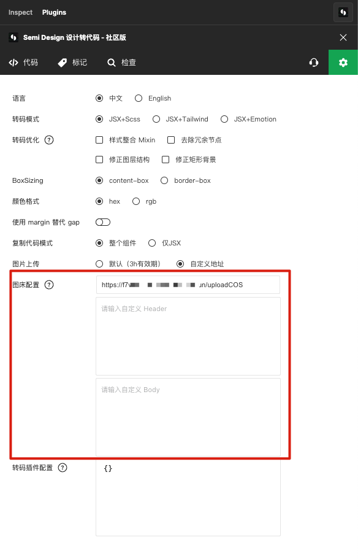
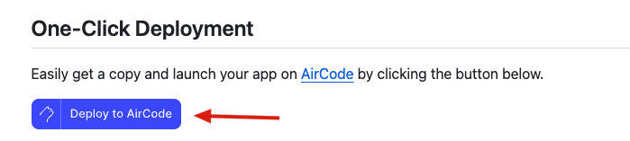
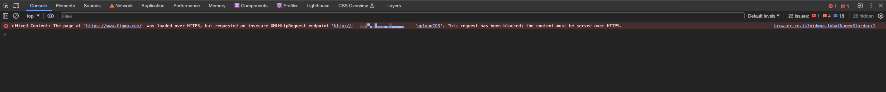

[D2C](https://semi.design/code/zh-CN/start/quick-start) 图片上传示例，nodejs 实现。[English Version](./README-en.md)

示例列表：

- ✅ 云函数，只需要关心核心图片上传逻辑，无须绑定域名，每个函数是一个接口
  - [upload.js](./examples/aircode/upload.js): 使用 [AirCode](https://docs.aircode.io) 文件存储（免费额度 2GB）
  - [uploadCOS.js](./examples/aircode/uploadCOS.js): 使用 [Tencent 对象存储 SDK](https://cloud.tencent.com/document/product/436/8629)，需绑定 COS AccessID、AccessKey

AirCode 支持一键复制项目，[一键复制](https://aircode.io/dashboard?owner=shijiatongxue&repo=d2c-image-upload-examples&path=examples%2Faircode&appname=d2c-image-bed-aircode-example) 示例（需要登录）

- ✅ nodejs 自定义 Web Server：完全的控制，需绑定域名
  - [index.js](./examples/nodejs/src/index.js)：使用 [koa](https://koajs.com/) + [Tencent 对象存储 SDK](https://cloud.tencent.com/document/product/436/8629) 自定义图片上传接口，需绑定 COS AccessID、AccessKey
- ❤️ 如你有更多的实现方式，欢迎提交 PR

注意：

- D2C 插件中的图片上传接口需要使用 `https` 协议，因为 Figma 插件环境所在页面使用了 `https` 协议，由于[浏览器的安全策略](https://web.dev/articles/what-is-mixed-content)，使用 `http` 协议会出现下方报错。如你遇见这个问题，可以选择使用 `https` 协议或者使用云函数免费提供的 `https` 接口。

- AirCode 云函数的免费存储额度为 2GB，免费调用次数每月 10万 次。请在 [Price 页面](https://aircode.io/pricing) 查看免费额度以及付费计划。