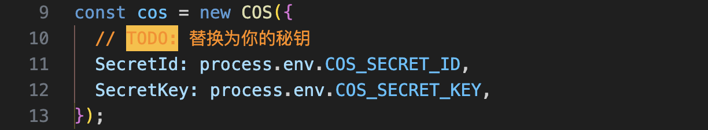
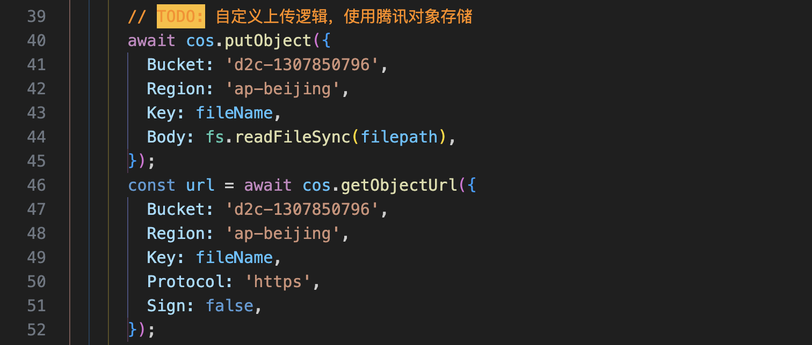

## Run 

```bash
npm install
npm start
```

## Notice

- If you use Tencent Object Storage, please replace `SecretId` and `SecretKey`.



- If you use other storage services, please modify the file upload code.

